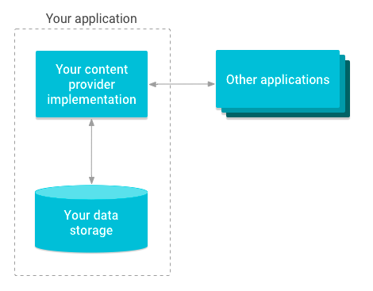

# Android 4대 컴포넌트

## 4. Content Provider [[참고 사이트 #1]]

- 데이터를 저장하고, 가져오고, 모든 App에서 접근 할 수 있도록 하는 컴퍼넌트  
  다른 앱의 데이터를 사용하고자 하는 앱에서는 **URI**를 이용하여 콘텐츠 리졸버를 통해 다른 앱의
  Content Provider에게 데이터 요청.  
  요청 받은 Content Provider는 **URI** 확인 하고 데이터를 꺼내 컨텐츠 리졸버에게 전달.

### **안드로이드 권장 URI 형식**
<pre><code>Content://Authority/path/id</code></pre>
content : 스키마 (어떤 구조로 데이터가 저장되는가를 나타내는 구조)  
Authority : Content Provider 의 명칭  
path : 정보의 위치 (사용자 정의영역)   
id : 특정 정보를 지칭 (사용자 정의영역)

> _스키마 : 제약조건에 관해 전반적인 명세를 기술한 것_
> _URI : 존재하는 자원을 식별하기 위한 것_

[참고 사이트 #1]: https://lucky516.tistory.com/171