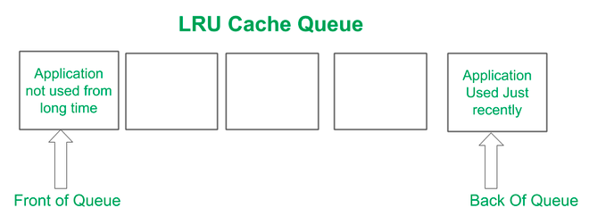

# Process Lifecycle

### 📌 Android Process 관리 기본 원리
- 안드로이드 어플리케이션은 리눅스 프로세스 상에서 동작한다.
- 한 앱 컴포넌트가 시작하고 다른 앱의 컴포넌트가 실행중이지 않으면 안드로이드 시스템은 하나의 스레드 실행과 함께 새로운 리눅스 프로세스를 시작.
- 컴포넌트가 실행 시작하려하는데 이미 그 앱의 다른 컴포넌트의 프로세스가 존재한다면 같은 프로세스, 같은 스레드에서 실행되는 것이 기본이다.
  - 하지만 하나의 앱에 다른 각 컴포넌트를 다른 프로세스, 다른 스레드를 만들어 실행시킬 수 있다.
- 방법은 `AndroidManifest.xml`에 `<activity>`, `<service>`, `<receiver>`, `<provider>` 엔트리를 넣고 `android:process` 속성값을 주어 각 컴포넌트가 어느 프로세스에서 실행되어야 하는지를 명시할 수 있다.
- 프로세스는 앱의 코드가 실행되어야할 때 만들어지고, 더이상 필요하지 않거나 시스템이 다른 앱을 위해 메모리를 재확보해야할 때까지 실행된다.
- 앱 프로세스의 생명주기는 앱 자체가 아니라 앱의 컴포넌트들의 조합을 통해 시스템에 의해서 결정된다.
  - 각 컴포넌트들이 얼마나 사용자에게 중요한지와 얼만큼의 메모리가 사용가능한지에 따라 결정.
  - 안드로이드 앱 개발자는 각 구성요소들 **특히 `Activity`, `Service`, `Broadcast reciver`가 어떻게 앱 프로세스 생명주기에 영향을 미치는지** 알아야 한다.
- 메모리가 부족할 때 시스템은 프로세스를 죽여야하는데 그 순서는 실행되고 있는 컴포넌트와 컴포넌트 상태로 결정된다. 뭔말이야
  - 그것을 기반으로 중요한 순서를 매기고 중요하지 않은 프로세스부터 죽인다.
- 프로세스의 우선순위는 종속성에 따라 증가할 수도 있다.
  - A 가 B 프로세스에 있는 컴포넌트에 종속되어있다면 B 가 우선순위가 더 높다.

### 📌 Android Application  최적화에서 LRU 캐시 역할
- 안드로이드 운영체제가 자원을 제대로 관리하기 위해 LRU(Least Recent Used) 캐시라는 캐시에 가장 적게 사용된 어플리케이션을 푸시한다.
- 애플리케이션이 아주 오랫동안 사용되지 않으면 LRU의 큐로 푸시되어 큐의 맨 앞에 있게 된다.
- 응용프로그램이 가까운 시간 내에 사용될 경우, 해당 응용프로그램은 대기열의 맨 뒤에 있고, 가장 최근에 사용된 응용프로그램은 대기열의 맨 뒤에 있습니다.

### 📌 Process 의 4가지 타입
1️⃣ foreground process
- 현재 사용자가 하고 있는 것을 위해 필요한 프로세스
  - 현재 사용자가 상호작용하고 있는 화면 최상단의 `Activity` 가 `onResume()` 부터 실행되고 있을 때
  - `BroadcastReceiver.onReceive()` 메서드가 실행중 일 때
  - `Service` 가 가진 `onCreate()`, `onStart()` 또는 `onDestroy()`중 하나로 코드가 실행되고 있을 때
- **메모리가 부족할 때 최후의 수단으로 죽임**

2️⃣ visible process
- 사용자가 현재 인지하고 있는 것을 실행하는 프로세스
  - 사용자가 상호작용하고 있는 화면 최상단의 `Activity` 가 `onPause()` 가 실행 될 때
  - `Service.startForeground()`가 실행 될 때
  - 사용자가 인지하고 있는 특정 기능을 시스템이 사용하고 있는 서비스를 호스팅하는 것
- 모든 `foreground process`를 계속 실행하는데 필요한 경우가 아니면 종료되지 않음.

3️⃣ service process
- `startService`부터 서비스를 붙잡고 있는 프로세스
- 백그라운드 네트워크 업로드, 다운로드와 같이 사용자가 인지하고 있는 일들
- 1, 2번 모두 보존하는게 가능할 때까지만 유지한다.

4️⃣ cached process
- 당장 필요하지 않아서 메모리같은 자원이 필요하다면 언제든 죽일 수 있는 프로세스
- 사용가능한 캐시 프로세스들은 효율적으로 앱을 전환할 수 있게 함
- 주기적으로 오래된 캐시 프로세스를 죽임
- 일반적으로 사용자에게 보이지 않는 `onStop()`를 호출, 리턴한 하나 이상의 `Activity`를 잡고 있음.
  - 캐시 프로세스가 잡고 있는 `Activity` 의 인스턴스가 죽어도 생명주기로 save state 를 restore 하면 되기에 적절한 Activity 생명주기를 활용하는것이 중요.
    - save state 를 restore 하는 `Activity`는 새로운 프로세스에서 다시 만들어지긴 한다.
- 사용자가 마지막으로 본 `Activity`, 사용자의 홈 앱 등 유용한 정도의 순서로 결정되는 리스트로 관리됨.

5️⃣ empty precess
- `Activity` 컴포넌트를 갖고 있지 않은 프로세스
  - 다음에 재실행될 때 시작시간을 줄이기 위해 시스템이 프로세스를 캐싱하고 있다.

[[참고 사이트 #1]]  
[[참고 사이트 #2]]  

[참고 사이트 #1]: https://nosorae.tistory.com/entry/Android-%EC%95%88%EB%93%9C%EB%A1%9C%EC%9D%B4%EB%93%9C%EC%9D%98-Processes-%EC%99%80-App-Life-cycle  
[참고 사이트 #1]: https://www.geeksforgeeks.org/processes-and-application-lifecycle-in-android/