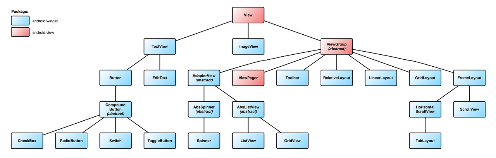
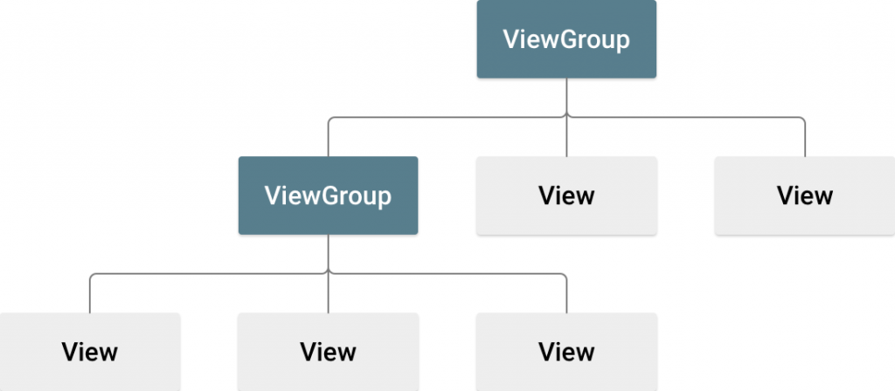

# View and ViewGroup

### 📌 View 와 ViewGroup 이란
- 안드로이드 화면을 구성하는 요소
- 화면에 보이는 모든 요소는 **View**이다.
- View를 담아 화면에 적절하게 배치하기 위해 필요한 것이 **ViewGroup**이다.
- 일반적으로 View 객체를 Widget 이라하고, ViewGroup 객체를 Layout 이라 부른다.

### 📌 View

- 모든 UI 관련 컴포넌트는 View 를 상속받아 구현된다.
- View 안에 View 를 포함할 수 있으며, 중첩하여 사용할 수 있다.
> ✏️ Note
> 대표적으로 사용하는 Widget
> - ImageView, TextView, EditText, Button 등

### 📌 ViewGroup

- ViewGroup 은 n개의 View를 포함할 수 있는 Container이다.
- n개의 View 를 포함하는 ViewGroup도 View를 상속받아 만들어진 클래스이다.
- ViewGroup 에는 View, ViewGroup이 포함될 수 있으며, ViewGroup은 결국 View를 포함한다.
- **모든 UI는 결국 View이다.**
> ✏️ Note
> 대표적으로 사용하는 Layout
> - LinearLayout, ConstraintLayout, FrameLayout, RelativeLayout 등

[[참고 사이트 #1]]  
[[참고 사이트 #2]]  
[[참고 사이트 #3]]  

[참고 사이트 #1]: https://kadosholy.tistory.com/127
[참고 사이트 #2]: https://hungseong.tistory.com/23
[참고 사이트 #3]: https://www.charlezz.com/?p=853