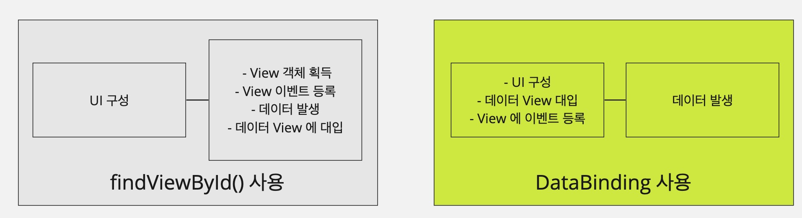

# DataBinding

`DataBinding` 은 안드로이드 JetPack 라이브러리 중 하나이다.  
Activity/Fragment 의 데이터를 화면에 출력하는 부분을 도와주는 `ACC(Android Archiecutre Component)`의 기법이다.  


### `DataBinding` 기초
`DataBinding` 을 사용하기 위해 모듈 수준의 build.gradle 파일에 아래와 같은 설정이 필요하다.
```xml
    buildFeatures {
        viewBinding true
        `DataBinding` true
    }
```


✏️ 예시  
```xml
<androidx.constraintlayout.widget.ConstraintLayout xmlns:android="http://schemas.android.com/apk/res/android"
    xmlns:app="http://schemas.android.com/apk/res-auto"
    xmlns:tools="http://schemas.android.com/tools"
    android:layout_width="match_parent"
    android:layout_height="match_parent"
    tools:context=".MainActivity">

    <Button
        android:id="@+id/btnStart"
        android:layout_width="wrap_content"
        android:layout_height="wrap_content"
        android:text="music Start"
        app:layout_constraintBottom_toBottomOf="parent"
        app:layout_constraintLeft_toLeftOf="parent"
        app:layout_constraintRight_toLeftOf="@id/btnStop"
        app:layout_constraintTop_toTopOf="parent" />

    <Button
        android:id="@+id/btnStop"
        android:layout_width="wrap_content"
        android:layout_height="wrap_content"
        android:text="music stop"
        app:layout_constraintBottom_toBottomOf="parent"
        app:layout_constraintLeft_toRightOf="@id/btnStart"
        app:layout_constraintRight_toRightOf="parent"
        app:layout_constraintTop_toTopOf="parent" />

</androidx.constraintlayout.widget.ConstraintLayout>
```

기존 `findViewById()`방식
```kotlin
class MainActivity : AppCompatActivity(), View.OnClickListener {

    lateinit var btnStart: Button
    lateinit var btnStop: Button

    override fun onCreate(savedInstanceState: Bundle?) {
        super.onCreate(savedInstanceState)
        setContentView(R.layout.activity_main)

        btnStart = findViewById(R.id.btnStart)
        btnStop = findViewById(R.id.btnStop)

        btnStart.setOnClickListener(this)
    }

    override fun onClick(view: View?) {
        Toast.makeText(this, "Start Button Click", Toast.LENGTH_SHORT).show()
    }
}
```

`findViewById()` 를 통해 View 객체를 다루는 코드이다. View 객체를 획득 후 View 객체에 데이터를 대입한다. 대입 된 View 에 이벤트를 등록한다.  
이러한 코드는 XML 에 정의한 View 를 획득하고자 `findViewById()` 메소드를 여러번 호출해야하며, 이벤트 처리를 위해 이벤트 관련 함수도 마찬가지로 호출해야한다.


`DataBinding` 방식 <span style="color: #808080">**(내가 쓰던 방식)**</span>
```kotlin
class MainActivity : AppCompatActivity() {

    val binding: ActivityMainBinding by lazy {
        ActivityMainBinding.inflate(layoutInflater)
    }

    override fun onCreate(savedInstanceState: Bundle?) {
        super.onCreate(savedInstanceState)
        setContentView(binding.root)

        binding.btnStart.setOnclickListener {
            Toast.makeText(this, "Start Button Click", Toast.LENGTH_SHORT).show()
        }
    }
}
```
<span style="color: #808080">binding 변수를 선언할 때 lazy 함수를 사용하여 실제로 사용 될 때 초기화 될 수 있도록 처리했음.  
setContentView() 에 필요한 파라미터도 binding 된 root View 자체를 넘길 수 있도록 처리했음.  
기존 findViewById() 사용한 Activity 처럼 OnClickListener 를 override 하지 않고 바로 View 에 적용하여 쓸 수 있도록 사용했음.</span>


`DataBinding` 방식 **(참고 사이트 방식)**
```kotlin
class MainActivity : AppCompatActivity() {
    lateinit var binding: ActivityMainBinding

    override fun onCreate(savedInstanceState: Bundle?) {
        super.onCreate(savedInstanceState)
        setContentView(R.layout.activity_main)

        binding = DataBindingUtil.setContentView(this, R.layout.activity_main)
        binding.myData = this
    }

    fun onClick(view: View?) {
        Toast.makeText(this, "Show Toast", Toast.LENGTH_SHORT).show()
    }
}
```
내가 사용한 방식과 동일하게 findViewById() 함수를 사용하지 않지만 같은 역할을 한다.  
해당 코드에 핵심은 **View 변수를 선언하지 않았다는 점** 이다.  
변수를 선언하지 않았으므로 코드에서 View 객체에 데이터를 대입하거나 이벤트를 등록하는 코드를 작성할 필요가 없다.  
대신 XML 에 약간의 작업이 추가된다.

<span style="color: #808080">여기서 나는 XML 는 View 일뿐, 이벤트를 등록하거나 View 를 그리는데에 관련이 없는건 하고 싶지 않기에 보통 XML 에서 작업하지 않고 Activity 나 Fragment 에서 작업했다.</sapn>

### DataBining 을 사용하는 XML
```xml
<?xml version="1.0" encoding="utf-8"?>
<layout xmlns:android="http://schemas.android.com/apk/res/android"
        xmlns:app="http://schemas.android.com/apk/res-auto"
        xmlns:tools="http://schemas.android.com/tools">

    <data>
        <variable
            name="myData"
            type="kr.co.lee.databindingexample.MainActivity" />
    </data>

    <androidx.appcompat.widget.LinearLayoutCompat
        android:layout_width="match_parent"
        android:layout_height="match_parent"
        android:orientation="vertical"
        tools:context=".MainActivity">

        <TextView
            android:text="@{myData.name}"
            android:id="@+id/nameView"
            android:layout_width="match_parent"
            android:layout_height="wrap_content" />

        <Button
            android:onClick="@{myData::onClick}"
            android:id="@+id/button"
            android:layout_width="match_parent"
            android:layout_height="wrap_content" />

    </androidx.appcompat.widget.LinearLayoutCompat>
</layout>
```

`DataBinding` 에 이용하고자 하는 XML 의 최상위 즉 Root 태그는 `<layout>`으로 선언해야한다.  
`<layout>`태그만 선언해도 자바코드에서 `findViewById()`함수나 변수 선언 없이 XML 에 정의한 View 객체를 바로 이용할 수 있다.

`<data>`태그를 선언하면 코드의 데이터가 자동으로 XML의 View 객체에 대입된다.  
예시에서는 `<data>`태그 내에 `myData` 라는 이름의 `variable`를 선언했다. 해당 `variable`은 XML 에서 이용하고자 변수를 선언한 것이다.  
선언한 `variable` 에 대입할 데이터 코드는 Activity/Fragment 코드에서 작성하고, 데이터를 대입할 View 는 XML 에 명시한다는 개념이다.

DataBining 이라는 것은 코드로 작성하던 부분을 XML 에 작성하는 개념이다. 화면을 XML 로 작성한다면 그 화면의 데이터 처리와 이벤트 처리 등도 XML 에 작성해서 코드에는 해당 데이터를 위한 작업 중심의 코드만 작성하는 것이다. 화면 처리와 작업 처리 부분을 분리해서 개발하는 기법이다.

## 📌 Jetpack 라이브러리의 AAC 등을 사용한 MVVM 패턴으로 코드를 작성하면 데이터는 ViewModel 에 선언하는 것이 좋다. [DataBining + MVVM](Data_binding_MVVM.md)


### Binding 클래스
- `DataBinding` 을 이용하면 `ActivityMainBinding` 과 같은 클래스가 자동으로 생성된다.
- 해당 클래스는 `<layout>` 태그로 선언된 XML 을 위해 자동으로 만들어지는 클래스이고 클래스명은 XML파일명을 따른다.

### DataBindingUtil.setContentView
- Activity 의 `setContentView()` 메소드를 사용하지 않고 `DataBindingUtil`클래스의 `setContentView()` 메소드를 사용하여 어떤 XML 을 이용할지 지정한다.

### Binding.setMyData()
- Binding 클래스에 XML 에서 선언한 `variable`데이터를 이용하기 위해 getter/setter 메서드와 XML 에 id 값이 등록된 View 객체가 멤버로 선언되어있다.
- 코드에서는 해당 멤버들을 사용하기만 하면 된다.


## Fragment 에서 `DataBinding`
```kotlin
class ExampleFragment : Fragment() {
    private var _binding: FragmentExampleBinding? = null

    private val binding
        get() = _binding!!


    override fun onCreateView(
        inflater: LayoutInflater,
        container: ViewGroup?,
        savedInstanceState: Bundle?
    ): View? {
        // 바인딩 클래스를 통해 지정(XML 지정 필요 없음)
        _binding = FragmentExampleBinding.inflate(inflater, container, false)
        // 직접 XML 파일 지정
        _binding = DataBindingUtil.inflate(inflater, R.layout.fragment_example, container, false)

        val view = binding.root

        return view
    }

    override fun onDestroy() {
        super.onDestroy()
        _binding = null
    }
}
```
- Binding 클래스인 DataBindingUtil.inflate 를 사용하여 XML 파일을 지정하면 된다.
- Single Activity 에서 Fragment 가 계속 변경될 때 메모리 절약을 하기 위해 onDestroy 안에서 binding 을 null 로 초기화한다.


## `DataBinding` 정리



[참고 사이트](https://velog.io/@changhee09/%EC%95%88%EB%93%9C%EB%A1%9C%EC%9D%B4%EB%93%9C-Data-Binding)