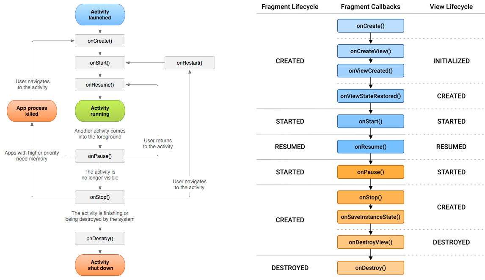

# Activity, Fragment 의 LifeCycle [[참고 사이트 #1]]

<table>
<tr>
<td>Activity Comment</td>
<td><strong>Activity</strong></td>
<td><strong>Fragment</strong></td>
<td>Fragment Comment</td>
</tr>
<tr>
<td></td>
<td rowspan="4"><code>onCreate()</code></td>
<td><code>onCreate()</code></td>
<td></td>
</tr>
<tr>
<td></td>
<td><code>onCreateView()</code></td>
<td rowspan="2">INITIALIZED</td>
</tr>
<tr>
<td></td>
<td><code>onViewCreated()</code></td>
</tr>
<tr>
<td></td>
<td><code>onViewStateRestored()</code></td>
<td>CREATED</td>
</tr>
<tr>
<td></td>
<td><code>onStart()</code></td>
<td><code>onStart()</code></td>
<td>STARTED</td>
</tr>
<tr>
<td></td>
<td><code>onResume()</code></td>
<td><code>onResume()</code></td>
<td>RESUMED</td>
</tr>
<tr>
<td></td>
<td>Activity running</td>
<td>Fragment running</td>
<td></td>
</tr>
<tr>
<td>User returns to the activity ➡️ <code>onResume()</code></td>
<td><code>onPause()</code></td>
<td><code>onPause()</code></td>
<td>STARTED</td>
</tr>
<tr>
<td rowspan="3">User navigates to the activity ➡️ <code>onRestart()</code> ➡️ <code>onStart()</code></td>
<td rowspan="3"><code>onStop()</code></td>
<td><code>onStop()</code></td>
<td rowspan="2">CREATED</td>
</tr>
<tr>
<td><code>onSaveInstanceState()</code></td>
</tr>
<tr>
<td><code>onDestroyView()</code></td>
<td>DESTROYED</td>
</tr>
<tr>
<td></td>
<td><code>onDestroy()</code></td>
<td><code>onDestroy()</code></td>
<td>Fragment detach</td>
</tr>
<tr>
<td></td>
<td>Activity shut down</td>
<td></td>
<td></td>
</tr>
</table>

### Activity
💡 `onCreate()`
- 필수적으로 구현.
- **시스템이 Activity를 생성할 때 실행된다.**
- Activity는 생성되면서 `CREATED` 상태가 된다.
- `onCreate()` 에서는 데이터를 바인딩하거나, Activity와 `ViewModel`을 연결한다.
- `savedInstanceState` 라는 매개변수가 있는데, 해당 매개변수는
  Activity의 이전 상태에 대한 정보가 저장되어 있는 `Bundle` 객체이다.
    - 처음 생성되었다면 해당 매개 변수는 `null` 이다.
    - 연결된 수명 주기 인식 구성요소가 있다면 `ON_CREATE` 이벤트를 수신한다.
---
💡 `onStart()`
- Activity 가 `STARTED` 상태에 들어가면 시스템은 `onStart()` 콜백을 호출한다.
- **호출되면 해당 Activity 가 사용자에게 표시되는 단계이며, 앱이 Activity 를 포그라운드에 보내 사용자와
  상호작용할 준비를 시작한다.**
- 앱이 UI 관리하는 코드를 초기화 한다.
- 연결 된 생명 주기 인식 구성요소는 `ON_START` 이벤트를 수신한다.
---
💡 `onResume()`
- Activity 가 `RESUMED` 상태에 들어가면 시스템은 `onResume()` 콜백을 호출한다.
- **Activity는 포그라운드에 표시되며 앱이 사용자와 상호작용한다.**
- 어떠한 이벤트로 앱의 포커스가 사라지기 전까지 앱은 이상태로 유지한다.
- 전화가 오거나, 멀티 윈도우 상태에서 다른 앱과 상호작용하는 경우가 생긴다면 Activity는
  `PAUSED` 상태로 되며 시스템이 `onPause()` 콜백을 호출한다.
- Activity 가 `PAUSED` 상태에서 다시 `RESUMED` 상태로 돌아오면 시스템이 `onResume()` 다시 호출한다.
---
💡 `onPause()`
- **사용자가 Activity를 잠시 떠나면 시스템은 `onPause()` 콜백을 호출한다.**
    - 잠시 떠난다는 뜻은 Activity가 **소멸** 되었다는 뜻이 아닌, Activity 의 포커스를 잃었을 때를 말한다.
- `onPause()` 를 사용하여 포그라운드에 있지 않을 때 배터리 성능에 영향을 미치는 불필요한 기능들을 모두 정지할 수 있다.
- 하지만, `onPause()`는 아주 잠깐 실행되기에 데이터 저장 작업은 실행하기에 시간이 부족할 수 있다.
    - 데이터 저장 작업과 같은 행동은 `onStop()`에서 처리하는게 적합하다.
---
💡 `onStop()`
- **Activity 가 더이상 사용자에게 표시되지 않으면 시스템은 `onStop()` 콜백을 호출한다.**
  💡- `onStop()` 를 사용하여 CPU를 많이 소모하는 데이터 저장 작업 등을 저장하는 적합한 시기이다.
- 하지만, Activity가 완전히 **종료** 되지 않았기때문에 다시 시작되어 사용자와 상호작용을 할 수 있다.
    - Activity 가 다시 시작되면 `onRestart()` 를 호출.
    - Activity 가 완전 종료되면 `onDestroy()` 를 호출.
---
💡 `onDestroy()`
- **Activity 가 완전히 소멸되기 직전에 호출된다.**
    - Activity 의 `finish()` 가 호출 되는 경우
    - 기기 회전, 멀티 윈도우 모드로 인하여 시스템이 일시적으로 Activity를 소멸 시키는 경우
- `onDestroy()` 를 사용하여 `onStop()` 에서 해재되지 않은 리소스를 해제해야한다.
---

### Fragment
💡 `CREATED`
- **`CREATED` 상태이면 이미 `onAttach()`를 통해 `FragmentManager` 에 추가된 상태.**
    - 해당 상태에서 데이터 초기화, 복구 및 저장된 상태를 불러온다.
- `savedInstanceState` 가 `null` 이라면 Fragment가 생성되는 것이고, 그렇지 않다면 재 생성 된다.
- 아직 Fragment 안에 선언되어 있는 `View`는 생성되지 않는다.
---
💡 `STARTED`
- **Fragment 안에 있는 `View`를 사용할 수 있는 상태**
---
💡 `RESUMED`
- **Activity와 마찬가지로 사용자와 Fragment가 상호작용하는 단계이다.**
---
💡 `STARTED`
- Fragment의 `onPause()` 를 호출하는 단계이지만 Activity 와 다르게 **`PAUSED` 가 아닌 `STARTED`상태이다**
- **사용자로부터 Fragment의 포커스를 잃은 상태이다**
- 옵저버에게 `ON_PAUSE` 이벤트를 보냄으로써 위의 `STARTED`와는 차이가 있다.
---
💡 `CREATED`
- 상태명은 다르지만 Activity와 마찬가지로 **더 이상 Fragment가 포그라운드에서 보이지 않게 되는 상태**
- 옵저버에게 `ON_STOP` 이벤트를 보낸다.
- `onDestroyView()` 가 호출되면 Fragment 의 View 는 detach 되며 옵저버에게 `ON_DESTROY` 이벤트를 보낸다.
- Fragment 는 가비지 컬렉터에 의해 제거될 준비를 위해 관련 데이터들을 안전하게 제거되어야 한다.
---
💡 `DESTROYED`
- Fragment 안에 있는 View가 detach 되고 **Fragment 가 `FragmentManager` 로 부터 detach 되어 소멸 된다.**

[참고 사이트 #1]: https://kumgo1d.tistory.com/76