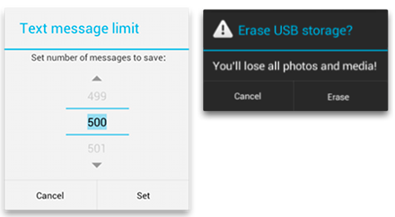
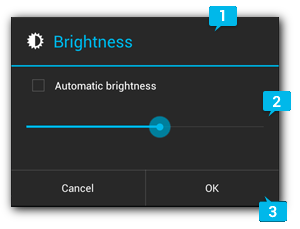

# Dialog [[Android Developer]]
- `Dialog` 는 사용자에게 추가 정보를 입력 또는 결정을 내릴 때 표시하는 작은 화면을 뜻한다.  

- `Dialog` 클래스가 `Dialog`의 기본 클래스이지만, `Dialog` 를 직접 인스턴스화 하는 것은 삼가해야 한다.
  - `AlertDialog` : 제목 한 개, 버튼 최대 세 개, 선택 가능한 항목 목록 또는 맞춤 레이아웃 한 개를 표시할 수 있는 `Dialog` 이다.
  - `DatePickerDialog` 또는 TimePickerDialog : 미리 정의된 UI가 있는 `Dialog`이며, 사용자가 날짜 또는 시간을 선택할 수 있다.
- `Dialog` 의 컨테이너로 `DialogFrgment`를 사용해야 한다.
- `DialogFragment` 클래스는 `Dialog` 객체의 메서드를 호출하는 대신 `Dialog`를 만들고 UI를 관리하는 데 필요한 모든 컨트롤을 제공한다.
- `DialogFragment`를 사용하면 사용자가 뒤로가기 버튼을 누르거나 화면을 돌리는 것과 같은 생명 주기 이벤트를 처리할 수 있다.

### 📌`DialogFragment` 생성
- `DialogFragment`를 확장하고, `onCreateDialog()` 콜백 메서드에서 `AlertDialog`를 생성하면 된다.
```kotlin
class StartGameDialogFragment : DialogFragment() {

    override fun onCreateDialog(savedInstanceState: Bundle): Dialog {
        return activity?.let {
            // Use the Builder class for convenient dialog construction
            val builder = AlertDialog.Builder(it)
            builder.setMessage(R.string.dialog_start_game)
                    .setPositiveButton(R.string.start,
                            DialogInterface.OnClickListener { dialog, id ->
                                // START THE GAME!
                            })
                    .setNegativeButton(R.string.cancel,
                            DialogInterface.OnClickListener { dialog, id ->
                                // User cancelled the dialog
                            })
            // Create the AlertDialog object and return it
            builder.create()
        } ?: throw IllegalStateException("Activity cannot be null")
    }
}
```
- 클래스의 인스턴스를 생성하고 이 객체에서 `show()`를 호출하면 대화상자가 노출된다.

### 📌 `Dialog` 빌드
- `AlertDialog` 클래스를 사용하면 여러 가지 `Dialog` 디자인을 빌드할 수 있다.
   
1. 제목
- 선택사항이며 콘텐츠 영역에 상세한 메세지, 목록 또는 커스텀 레이아웃이 채워져 있는 경우에만 사용.
- 단순한 메세지 또는 질문을 나타내야 하는 경우 생략 가능.

2. 콘텐츠 영역
- 메세지, 목록 또는 다른 켜스텀 레이아웃을 표시할 수 있다.

3. 버튼
- `Dialog` 에 버튼이 **3개** 초과하면 안됨.
```kotlin
val builder: AlertDialog.Builder? = activity?.let {
    AlertDialog.Builder(it)
}

// 2. Chain together various setter methods to set the dialog characteristics
builder?.setMessage(R.string.dialog_message)
        .setTitle(R.string.dialog_title)

// 3. Get the <code><a href="/reference/android/app/AlertDialog.html">AlertDialog</a></code> from <code><a href="/reference/android/app/AlertDialog.Builder.html#create()">create()</a></code>
val dialog: AlertDialog? = builder?.create()
```

### 📌 버튼 추가
```kotlin
val alertDialog: AlertDialog? = activity?.let {
    val builder = AlertDialog.Builder(it)
    builder.apply {
        setPositiveButton(R.string.ok,
                DialogInterface.OnClickListener { dialog, id ->
                    // User clicked OK button
                })
        setNegativeButton(R.string.cancel,
                DialogInterface.OnClickListener { dialog, id ->
                    // User cancelled the dialog
                })
    }
    // Set other dialog properties
    ...

    // Create the AlertDialog
    builder.create()
}
```
- Positive
  - 작업을 수락하고 계속 진행하는 데 사용. (ex. OK)
- Negative
  - 작업을 취소하는 데 사용. (ex. Cancel)
- Neutral
  - Positive 와 Negative 중간. (ex. 나중에 알림)


[Android Developer]: https://developer.android.com/develop/ui/views/components/dialogs