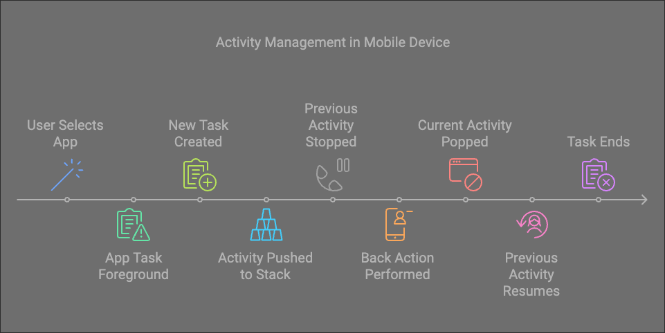

# Tasks and Back Stack

### What is `Task` ?
- 사용자에 의해 실행된 Activity 들의 모음.
- Activity 들은 생성되면서 "`Back Stack`" 이라 불리는 Stack 에 쌓이게 됨.

1. User Selectes App  
사용자가 홈 화면이나 앱 런처에서 앱을 실행한다.

2. App Task Foreground  
이미 진행 중인 `task`가 있는 경우 foreground 로 이동하여 현재 Activity 를 표시한다.

3. New Task Created  
진행 중인 `task`가 없는 경우 새로운 `task` 가 생성되고 앱의 `Back Stack` 에 root activity 로 MainActivity 가 표시된다.

4. Activity Pushed to Stack  
현재 머무르는 Activity 에서 다른 Activity 를 실행 했을 때, task 의 상단에 새로운 Activity 가 추가되며, 추가 된 Activity 가 표시된다.

5. Previous Activity Stopped  
task 의 이전 Activity 는 destroy 되지 않고 stopped 상태를 유지한다. 사용자가 이전 Activity 로 돌아갈 경우를 대비하여 UI 상태가 유지된다.

6. Back Action Performed & Current Activity Popped  
사용자가 뒤로가기 버튼을 클릭하면 현재 바라보고 있는 Activity 는 task 의 상단에서 제거되어 destroy 된다. 

7. Previous Activity Resumes  
destroy 된 Activity 의 이전 Activity 가 resume 된다. 시스템에서 이전 저장된 UI 를 복원한다.

8. Task Ends  
사용자가 계속 뒤로가기 버튼을 클릭하게 되면 root activity 까지 도달하여 제거될 때까지 activity 가 하나씩 destroy 된다.모든 Activity 가 destory 되면 해당 task 도 사라진다.

> ### Back Stack  
> Back Stack 은 LIFO (후입선출) 구조이다.  
> - Activity 는 시작 될 때에만 task 에 추가 된다.
> - 뒤로가기 버튼으로 인해 닫히면 destroy 된다.
> - Activity 는 task 내에서 재배열 되지 않는다.

---

- Task Behavior  
task 는 사용자가 다른 task 를 시작하거나 홈 화면으로 이동 할 때 background 로 이동할 수 있는 Activity 그룹이다.  
task 의 back stack 은 background 에 있는 동안 유지된다.

- Foreground Task  
Activity 가 foreground 로 표시되면 모든 Activity 와 상태가 복원되고 사용자는 중단한 부분부터 계속 진행할 수 있다.

- Task Switching  
사용자는 홈화면 또는 최근 화면을 사용하여 Activity 간에 전환할 수 있다.  
✏️ 예시. Task B 가 시작되면 Task A 는 background 로 이동. 사용자는 나중에 Task A 로 다시 전환 할 수 있다.

- Multiple Tasks  
여러개의 Task 가 Background 에서 동시에 존재할 수 있다. 하지만, 시스템에 메모리가 부족하면 일부 background task 가 삭제될 수 있다.

- Memory Management  
삭제된 task 는 Activity 상태 값을 잃게 되므로 사용자는 Activity 를 실행할 때 다시 시작해야한다.

----

- Activity Instances 는 재배열되지 않는다.  
  - Back Stack 의 Activity 는 절대 재배열되지 않는다. 앱에서 사용자가 여러 Activity 에서 동일한 Activity 를 시작할 수 있도록 허용하는 경우 해당 Activity 는 새 인스턴스가 생성되어 매번 Stack 에 추가된다.  
  - 이미 존재하는 Activity 를 새로운 인스턴스로 생성되어도 Stack 맨 위로 가져오지 않는다.

- 동일한 Activity 의 여러 인스턴스
  - 재배열되지 않기 때문에 동일한 Activity 의 여러 인스턴스가 생성될 수 있다.
  - 각 인스턴스는 Back Stack 에 독립적으로 존재한다.
  - 각각 고유한 UI 상태와 데이터가 있다.

- Navigating Back
  - 사용자가 뒤로가기 버튼이나 동작을 사용하여 뒤로가는 경우
    - Activity 는 추가된 역순(후입선출)로 표시된다.
    - 각 인스턴스는 마지막으로 활성화되었을 때의 상태로 나타난다.

- Customizing Behavior
  - 동일한 Activity 가 여러번 실행되는 것을 방지하려면 다음 동작을 수정하면 된다.
    - `FLAG_ACTIVITY_SINGLE_TOP` 또는 `FLAG_ACTIVITY_CLEAR_TOP`와 같은 인텐트 플래그를 사용.
    - `AndroidManifest.xml` 파일의 Activity manifest (`singleTask`, `singleInstance` 등)에서 `launchMode`를 구성.

서로 다른 Context 에서 시작된 경우 동일한 Activity 가 여러 task 에 존재할 수 있으므로 인스턴스의 독립성이 더욱 강조된다.

### Activity and Task Lifecycle
1. Task 내에서 Activity 전환
  - 새로운 Activity
    - Activity A -> Activity B 로 시작.
      - Activity A 는 중지되었지만 시스템은 마지막 상태(✏️ 스크롤 위치, 입력 필드 등) 을 유지.
      - 사용자는 뒤로가기 버튼 또는 동작을 사용하여 Activity A 로 돌아갈 수 있으며 이때 마지막 상태값을 복원.
- 뒤로 가기
  - 사용자가 Activity B 에 있는 동안 뒤로가기 버튼을 누르는 경우
    - Activity B는 destroy 되어 stack 에서 제거된다.
    - Activity A 는 이전 상태가 복원되어 표시.

2. Task 종료
- 홈 버튼 또는 제스처 사용
  - 사용자가 현재 task 를 종료하는 경우 (✏️홈 누르기)
    - 현재 Activity 가 중지되고 task 가 background 로 이동된다.
    - 시스템은 task 의 모든 Activity 상태를 유지한다.
- task 재개
  - 사용자가 나중에 다시 앱아이콘을 선택하는 경우
    - task 가 foreground 표시된다.
    - stack 상단의 activity은 task 가 background 로 들어가기 전 상태 그대로 다시 시작된다.

3. Back Stack 동작
- 사용자가 뒤로가기 동작을 수행할 때마다 현재 표시되고 있는 Activity 상태
  - Back Stack 에서 제거된다.
  - 제거되기때문에 유지하지 않는다.
  - Stack 의 이전 Activity 가 표시된다.

4. 여러개의 Activity 인스턴스
- Activity 는 다른 task 내에서도 여러번 인스턴스화될 수 있다.
- 각 인스턴스는 자체 상태와 Back Stack 위치를 사용하여 독립적으로 동작한다.
- `launchMode` 또는 Intent flag 를 사용하여 맞춤설정할 수 있다.

### Manage tasks
매니페스트 속성 및 인텐트 플래그를 사용하여 기본 동작을 설정할 수 있다.

1. Launch Mode
- Manifest 설정
  - `<activity>` 태그의 `launchMode` 속성에 정의
  - task 와 Activity 의 연결에 대한 기본 동작을 지정
- Intent Flags
  - 특정 플래그를 사용하여 `startActivity()`를 호출할 때 동적으로 설정
  - 인텐트 플래그는 매니페스트에 정의된 동작을 재정의하여 사용

2. Manifest
- `standard`(default)
  - task 의 새로운 인스턴스는 항상 생성되어 Back Stack 에 추가
  - 동일한 Activity 의 여러 인스턴스가 동일하거나 다른 task 에 존재할 수 있다.
- `singleTop`
  - Activity 가 이미 stack 의 최상위에 있는 경우 `onNewIntent()`를 통해 인텐트가 기존 인스턴스로 전달한다.
  - 상단에 없으면 새로운 인스턴스 생성.
- `singleTask`
  - Activity는 새로운 task 의 root Activity 가 되거나 동일한 `affinity` 를 가진 기존 task 를 재사용.
  - Back Stack 의 기존 인스턴스 위의 모든 Activity 제거.
  - Background task 에 Activity 가 포함되어있으면 전체 task 가 foreground 로 표시.
- `singleInstance`
  - `singleTask`와 유사하지만 task 에 다른 Activity 를 시작할 수 없음.
  - 해당 Activity 의 각 인스턴스는 자체 격리된 task 에 존재.
- `singleInstancePerTask`
  - `singleTask`와 유사하지만 특정 인텐트 플래그(`FLAG_ACTIVITY_MULTIPLE_TASK` 또는 `FLAG_ACTIVITY_NEW_DOCUMENT`)가 설정된 경우 다양한 task 에서 Activity의 여러 인스턴스를 허용.
  - task 당 하나의 인스턴스만 가능.

3. Intent Flags
- `FLAG_ACTIVITY_NEW_TASK`
    - 새로운 task 에서 Activity 를 시작.
    - `singleTask`와 유사하지만 동적으로 적용.
    - 다른 task 에 인스턴스가 이미 존재하는 경우 해당 task 가 foreground 로 이동.
- `FLAG_ACTIVITY_SINGLE_TOP`
    - Activity 가 이미 Stack 상단에 있는 경우 새로운 인스턴스를 생성하는 대신 `onNewIntent()`를 통해 인텐트를 처리.
    - Manifest의 `singleTop`과 유사.
- `FLAG_ACTIVITY_CLEAR_TOP`
    - 현재 Task 에 해당 Activity 가 존재하는 경우 그 위의 모든 Activity 는 destroy된다.
    - 인텐트는 `onNewIntent()`를 통해 기존 인스턴스에 전달.
    - 📌 종종 `FLAG_ACTIVITY_NEW_TASK`와 함께 사용되어 다른 task의 Activity 를 찾아 foreground로 이동.

4. Behavior Overview
<table border="1" style="border-collapse: collapse;">
<thead>
<tr style="background-color:rgba(242, 242, 242, 0.43); font-weight: bold; text-align: center;">
<td>Launch Mode</td>
<td>New Instance</td>
<td><code>onNewIntent()</code>를 통해 인텐트 처리</td>
<td>Clears Stack</td>
<td>Task 연관</td>
</tr>
</thead>
<tr>
<td><code>standard</code></td>
<td>Always</td>
<td>NO</td>
<td>NO</td>
<td>동일하거나 다른 Task</td>
</tr>
<tr>
<td><code>singleTop</code></td>
<td>위에 있지 않은 경우</td>
<td>YES(맨 위에 있는 경우)</td>
<td>NO</td>
<td>같은 Task</td>
</tr>
<tr>
<td><code>singleTask</code></td>
<td>Only root</td>
<td>YES</td>
<td>그 위의 Activity 제거</td>
<td>신규 또는 기존 Task(동일한 연관성)</td>
</tr>
<tr>
<td><code>singleInstance</code></td>
<td>Only root</td>
<td>YES</td>
<td>그 위의 Activity 제거</td>
<td>고립 된 Task</td>
</tr>
<tr>
<td><code>singleInstancePerTask</code></td>
<td>Only root</td>
<td>YES</td>
<td>그 위의 Activity 제거</td>
<td>다중 Task(Task 당 하나의 인스턴스)</td>
</tr>
</table>

