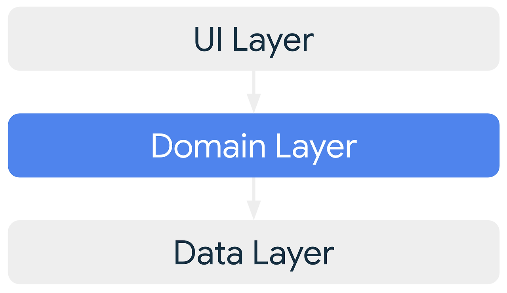

# Android App Architecture

- App Components  
Android 앱에는 app manifest를 통해 관리되는 activities, fragments, services, content providers, broadcast receivers 가 포함 되어있다.
- Adaptability  
Components가 독립적으로 실행되거나 순서에 맞지 않게 실행되거나 종료될 수 있는 workflows, lifecycle 를 처리해야한다.
- 리소스 제한  
OS 는 메모리를 확보하기 위해 앱 프로세스를 종료할 수 있으므로 Components는 서로 의존하거나 중요한 데이터를 저장하면 안된다.


### 4가지의 일반 아키텍처 원칙
- 관심사 분리
    - 아키텍처 원칙에서 가장 중요한 원칙.
    - Activity 나 Fragment 같은 UI 기반의 클래스는 UI 및 운영체제 상호작용을 처리하는 로직만 포함하여 구성요소 생명주기와 같은 관련된 많은 문제를 피하고 테스트 가능성을 개선할 수 있다.
    - OS는 사용자 상호작용을 기반으로 또는 메모리 부족과 같은 시스템 조건으로 클래스를 제거할 수 있다. 이런 상황에서는 클래스에 대한 의존성을 최소화하는 것이 좋다.

- 데이터 모델에서 UI 도출하기
    - 데이터 모델은 앱의 데이터를 나타내며, 앱의 UI 요소 및 기타 구성요소로부터 독립되어 있기 때문에 데이터 모델에서 UI를 도출해야 한다.
    - 데이터 모델 클래스를 기반으로 앱 아키텍처를 구축하면 앱의 테스트 가능성과 견고함이 높아진다.

- 단일 소스 저장소 (SSOT)
    - 새로운 데이터 유형을 정의할 때 데이터 유형에 단일 소스 저장소를 할당해야 한다.
    - SSOT 는 데이터의 소유자이며, SSOT 만 데이터를 수정하거나 변경할 수 있다.
    - SSOT 는 이를 위해 불변 유형을 사용해 데이터를 노출하며, 다른 유형이 호출할 수 있는 이벤트를 수신하거나 함수를 노출해 데이터를 수정한다.
    > - 특정 유형 데이터의 모든 변경사항을 한 곳으로 일원화한다.
    > - 다른 유형이 조작할 수 없도록 데이터를 보호한다.
    > - 데이터 변경사항을 더 쉽게 추적할 수 있도록 한다.

- 단방향 데이터 흐름 (UDF)
    - Android 에서 상태 또는 데이터는 일반적으로 계층 범위의 상위 범위 유형에서 하위 범위 유형으로 흐른다.
    - 이벤트는 보통 하위 범위 유형에서 트리거되어 상응하는 데이터 유형의 SSOT 에 도달한다.   
        ✏️ 버튼 누르기와 같은 사용자 이벤트는 UI에서 SSOT로 흐르며, SSOT 에서는 애플리케이션 데이터가 불변 유형으로서 수정 및 변경된다.
    - UDF 는 데이터 일관성을 강화하고, 오류가 발생활 확률을 줄여주며 디버그하기 쉽고 SSOT 패턴의 모든 이점을 제공한다.

### 권장 앱 아키텍처

안드로이드에서 권장하고 있는 앱 아키텍처의 구조는 위의 그림과 같다.  애플리케이션에는 최소한 다음 두 가지 레이어가 포함되어야한다.

- 화면에 애플리케이션을 표시하는 UI 레이어
- 앱의 비지니스 로직을 포함하고 애플리케이션 데이터를 노출하는 데이터 레이어

다만, 여기서 UI 와 데이터 레이어 간의 상호작용을 간소화하고 재사용하기 위한 도메인 레이어 라는 레이어를 추가할 수 있다.

### 최신 앱 아키텍처
- 반응형 및 계층형 아키텍처
- 앱의 모든 레이어에서의 단반향 데이터 흐름(UDF)
- 상태 홀더가 있는 UI 레이어로 UI 의 복잡성 관리
- 코루틴 및 흐름
- 종속 항목 삽입 권장사항

### UI 레이어

UI 레이어의 역할은 화면에 애플리케이션 데이터를 표시하는 것이다. 사용자와 상호작용하고 외부 입력에 변경사항을 반영하도록 UI 를 업데이트 해야한다.

> UI 레이어 구성
> - 화면에 데이터를 렌더링하는 View 혹은 Jetpack Compose 함수를 사용해 빌드할 수 있는 UI 요소.
> - 데이터를 보유하고 이를 UI 에 노출하여로직을 처리하는 상태 홀더 (✏️ ViewMode 클래스)

### 데이터 레이어

데이터 영역에는 애플리케이션 데이터 및 비즈니스 로직이 포함된다. 비즈니스 로직은 앱에 가치를 부여하는 요소로 애플리케이션의 데이터 생성, 저장, 변경 방식을 결정하는 실제 비지니스 규칙을 구성된다.

앱에서 처리하는 다양한 유형의 데이터 별로 저장소 클래스를 만들어야 한다.

> - 앱의 나머지 부분에 데이터 노출
> - 데이터 변경사항 한 곳에 집중
> - 여러 데이터 소스 간의 충돌 해결
> - 앱의 나머지 부분에서 데이터 소스 추상화
> - 비즈니스 로직 포함

각 데이터 소스 클래스는 파일, 네트워크 소스, 로컬 데이터베이스와 같은 하나의 데이터 소스만 사용해야 한다.
데이터 소스 글래스는 데이터 작업을 위해 앱과 시스템 간의 연결 역할을 한다.


### 도메인 레이어

도메인 레이어는 복잡한 비즈니스 로직이나 여러 ViewModel 에서 재사용되는 간단한 비즈니스 로직의 캡슐화를 담당한다.
이 레이어는 선택사항임으로 복잡성을 처리하거나 재사용성을 선호하는 등의 필요한 경우에만 사용한다.

> - 코드 중복을 방지
> - 도메인 레이어 클래스를 사용하는 클래스의 가독성 개선
> - 앱의 테스트 가능성을 높임
> - 책임을 분할하여 대형 클래스를 방지

이러한 클래스를 간단하고 가볍게 유지하려면 각 사용 사례에서는 기능 하나만 담당해야 하고 변경 가능한 데이터를 포함해서는 안된다. 대신 개발자가 UI 레이어 또는 데이터 레이어의 변경 가능한 데이터를 처리해야 한다.


### UI 레이어, 데이터 레이어, 도메인 레이어의 Sample
- 데이터 레이어
```kotlin
// Repository
interface UserRepository {
    suspend fun getUsers(): List<User>
}

// Repository Implementation
class UserRepositoryImpl(
    private val localDataSource: UserDataSource,
    private val remoteDataSource: UserDataSource
) : UserRepository {
    override suspend fun getUsers(): List<User> {
        val localUsers = localDataSource.getUsers()
        return if (localUsers.isEmpty()) {
            val remoteUsers = remoteDataSource.getUsers()
            localDataSource.saveUsers(remoteUsers) // Cache remote data
            remoteUsers
        } else {
            localUsers
        }
    }
}

// Data Source Interface
interface UserDataSource {
    suspend fun getUsers(): List<User>
    suspend fun saveUsers(users: List<User>)
}

// Local Data Source
class LocalUserDataSource : UserDataSource {
    private val userDatabase = mutableListOf<User>()

    override suspend fun getUsers(): List<User> = userDatabase
    override suspend fun saveUsers(users: List<User>) {
        userDatabase.clear()
        userDatabase.addAll(users)
    }
}

// Remote Data Source (Mocked)
class RemoteUserDataSource : UserDataSource {
    override suspend fun getUsers(): List<User> = listOf(
        User("Alice"), User("Bob"), User("Charlie")
    )

    override suspend fun saveUsers(users: List<User>) {
        // No-op for remote source
    }
}

// User Data Class
data class User(val name: String)
```

- 도메인 레이어
```kotlin
class FetchUsersUseCase(private val userRepository: UserRepository) {
    suspend operator fun invoke(): List<User> {
        return userRepository.getUsers()
    }
}
```

- UI 레이어  
```kotlin
ViewModel


import androidx.lifecycle.ViewModel
import androidx.lifecycle.viewModelScope
import kotlinx.coroutines.flow.MutableStateFlow
import kotlinx.coroutines.flow.StateFlow
import kotlinx.coroutines.launch

class UserViewModel(private val fetchUsersUseCase: FetchUsersUseCase) : ViewModel() {
    private val _users = MutableStateFlow<List<User>>(emptyList())
    val users: StateFlow<List<User>> get() = _users

    init {
        loadUsers()
    }

    private fun loadUsers() {
        viewModelScope.launch {
            val fetchedUsers = fetchUsersUseCase()
            _users.value = fetchedUsers
        }
    }
}
```

```kotlin
UI with Jetpack Compose


import androidx.compose.foundation.layout.*
import androidx.compose.foundation.lazy.LazyColumn
import androidx.compose.foundation.lazy.items
import androidx.compose.material3.*
import androidx.compose.runtime.*
import androidx.compose.ui.Modifier
import androidx.lifecycle.viewmodel.compose.viewModel

@Composable
fun UserScreen(userViewModel: UserViewModel = viewModel()) {
    val users by userViewModel.users.collectAsState()

    Scaffold(
        topBar = {
            TopAppBar(title = { Text("User List") })
        }
    ) { padding ->
        LazyColumn(
            modifier = Modifier
                .fillMaxSize()
                .padding(padding)
        ) {
            items(users) { user ->
                Text(
                    text = user.name,
                    style = MaterialTheme.typography.bodyLarge,
                    modifier = Modifier.padding(16.dp)
                )
            }
        }
    }
}
```

[참고 사이트](https://everyday-develop-myself.tistory.com/208)